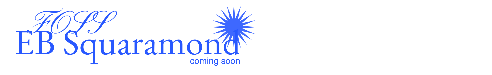

# EB Squaramond

## About EB Squaramond

Developed (in part) for use in the Diagram of a Silent Garden website, EB Squaramond aims is a pointier, sharper, less useful reworking of EB Garamond inspired by the angular textures created by few *very* different fonts. EB Squaramond uses EB Garamond as a starting point but looks to the original Egenolff-Berner specimen and Tory-Garamond for direction. See [this](https://www.are.na/jake-brussel-faria/eb-squaramond) Are.na channel for more information.

## About the Original

EB Garamond is intended to be an excellent, classical, Garamond. It is a community project to create a revival of Claude Garamont’s famous humanist typefaces from the mid-16th century. This digital version reproduces the original design by Claude Garamont closely: The source for the letterforms is a scan of a specimen known as the “Berner specimen,” which was composed in 1592 by Conrad Berner, the son-in-law of Christian Egenolff and his successor at the Egenolff print office. This specimen shows Garamont’s roman and Granjon’s italic types at different sizes. Hence the name of this project: Egenolff-Berner Garamond.

Why another Garamond? That typeface is a key moment in the history of typography, and European type designers have been reacting to this work ever since. It is probably the most revived typeface in the world and many are excellent. In the world of free/libre culture, however, only a few Garamond-inspired types exist, and none share the scope of this project.